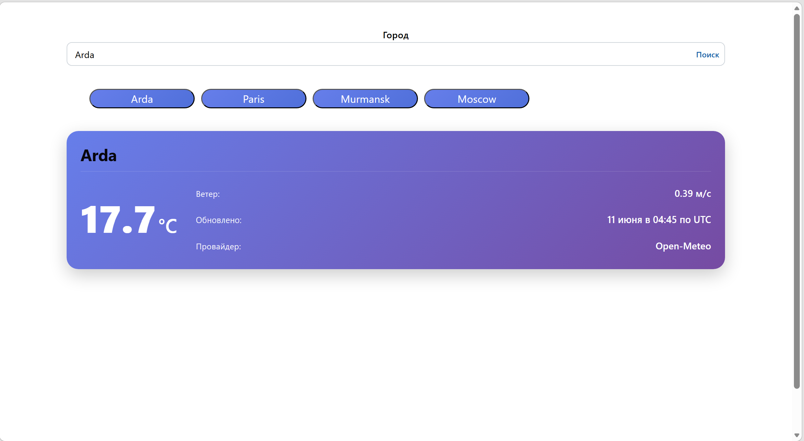
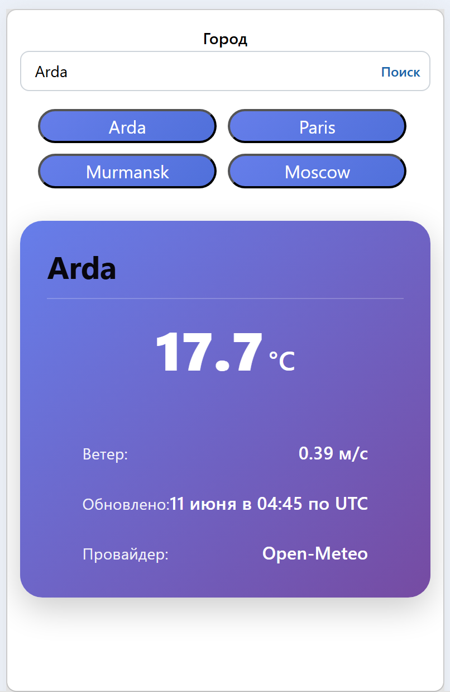

# Weather Card

Приложение для просмотра погоды в городах с историей поиска.

## Назначение

Веб-приложение позволяет пользователю:
- Искать погоду в любом городе
- Просматривать историю поиска
- Получать актуальную информацию о температуре, скорости ветра и времени наблюдения

## Технологии

- React 19
- TypeScript
- Mantine UI
- React Hook Form + Zod
- TanStack Query
- Vite
- Vitest + Testing Library

## Требования

- Node.js 20+
- pnpm 8+

## Установка

```bash
# Клонировать репозиторий
git clone <repository-url>
cd weathercard

# Установить зависимости
pnpm install

# Запуск в режиме разработчика
pnpm run dev

# Запуск тестов
pnpm vitest run
```
## Figma
Отсутствует

## Скриншоты

